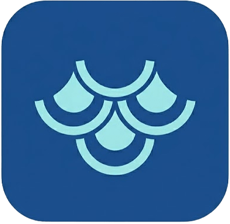
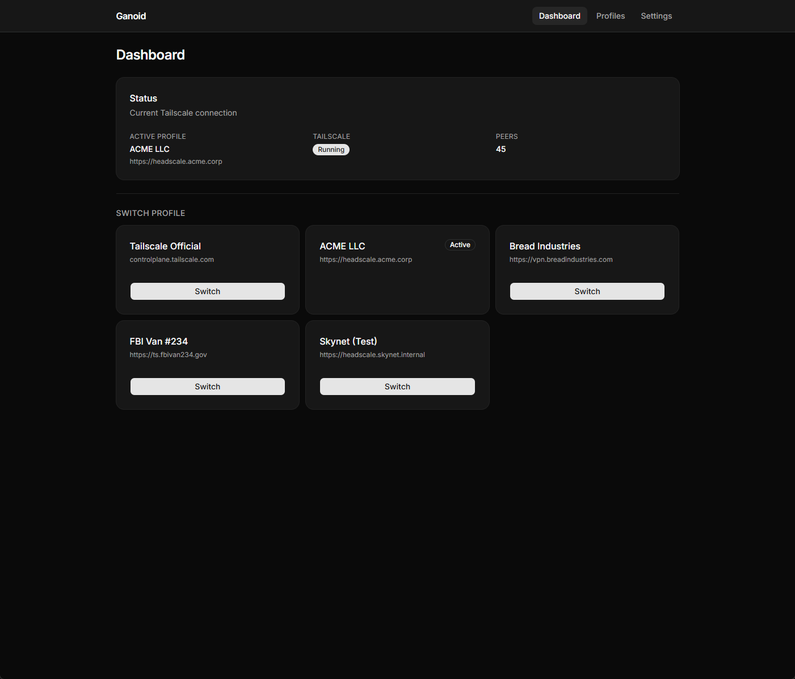
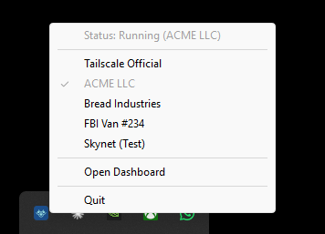

<p align="center">
  
</p>

<h1 align="center">Ganoid</h1>

<p align="center">
  A Tailscale coordination server profile manager for Windows.
  <br />
  Switch between self-hosted coordination servers without touching config files.
</p>

<p align="center">
  <a href="https://github.com/yashau/ganoid/releases/latest"></a>
  
  
</p>

---

## Overview

Ganoid is a two-component tool for managing multiple Tailscale profiles — each pointing at a different coordination server — without manual reconfiguration.

| Component | Description |
|-----------|-------------|
| `ganoidd` | Privileged daemon. Runs as a Windows service. Manages Tailscale state, serves the web UI and REST API. |
| `ganoid`  | System tray client. Monitors `ganoidd`, shows connection status, and lets you switch profiles from the tray or web UI. |

The two components communicate over a local HTTP API authenticated with a per-session bearer token. `ganoid` self-recovers if `ganoidd` restarts.

## Screenshots

<p align="center">
  
  <br /><em>Dashboard — active profile, Tailscale state, peer count, one-click switching</em>
</p>

<p align="center">
  
  <br /><em>System tray — live status and profile switcher</em>
</p>

## Installation

Run the following in PowerShell (elevation is handled automatically):

```powershell
irm https://raw.githubusercontent.com/yashau/ganoid/main/install.ps1 | iex
```

To install the latest pre-release instead:

```powershell
$GanoidPreview = $true; irm https://raw.githubusercontent.com/yashau/ganoid/main/install.ps1 | iex
```

The installer will:

1. Download `ganoidd.exe` and `ganoid.exe` from GitHub Releases
2. Install `ganoidd` as a Windows service (auto-start, LocalSystem)
3. Add a startup shortcut for `ganoid` to your user login
4. Create Start Menu shortcuts
5. Start everything immediately

## Usage

### System tray

`ganoid` sits in the system tray. Right-click for the menu — it is rebuilt live on every click from the API.

- **Status** — current Tailscale backend state and active profile name (top, greyed out)
- **Profiles** — configured profiles; active one is checkmarked; click any other to switch immediately
- **Open Dashboard** — opens the web UI in your browser
- **Quit** — exits the tray app (`ganoidd` keeps running as a service)

Double-clicking the tray icon also opens the dashboard.

### Web UI

- **Dashboard** — active profile, Tailscale state, peer count, one-click switching with live progress
- **Profiles** — add, edit, and delete profiles
- **Settings** — configure the listening port

Direct navigation and page refresh work on all routes.

## How it works

### Profile switching

Each profile maps a friendly name to a coordination server URL. Switching runs an 8-step sequence:

1. Stop the Tailscale service (so state files are stable)
2. Back up the current Tailscale state directory (with ControlURL verification)
3. Clear the active state directory
4. Restore the target profile's saved state (verified before restoring; falls back through up to 3 versioned backups)
5. Write the login server URL to the registry
6. Start the Tailscale service
7. Finalize
8. Update the active profile in Ganoid's config

Up to 3 versioned backups are kept per profile (`.v1`, `.v2`, `.v3`), rotated automatically. Before overwriting a backup, the live state's ControlURL is verified to match the current profile. Before restoring, each backup version's ControlURL is checked — corrupted or mismatched versions are skipped.

Switch progress is streamed live in the web UI. The tray also triggers a switch directly.

### First login

After switching to a profile for the first time, Tailscale will be in the `NeedsLogin` state. Open the Tailscale app or run `tailscale login` to authenticate with the new coordination server.

### Debug logging

Logs are written to `C:\ProgramData\Ganoid\ganoidd.log`. Default log level is `info`. To enable full debug logging:

```cmd
set-log-level.cmd debug
```

To revert:

```cmd
set-log-level.cmd info
```

## Uninstall

```powershell
irm https://raw.githubusercontent.com/yashau/ganoid/main/uninstall.ps1 | iex
```

Ganoid config and profile state backups are left intact.

## Building from source

**Prerequisites:** Go 1.26+, Node.js, pnpm, goversioninfo

```powershell
# Windows
.\build.ps1 -Version 0.2.0

# All platforms
.\build.ps1 -Version 0.2.0 -Target all
```

The build script compiles the SvelteKit UI, generates Windows version resources, and produces `ganoidd.exe` + `ganoid.exe` with version metadata embedded.

## Platform support

Ganoid is developed and tested on Windows only. The codebase includes Linux and macOS stubs that compile but are not functional. If you're interested in bringing Ganoid to other platforms, feel free to fork the repo, implement the platform layer, and submit a PR.

## Name

*Ganoid* refers to the type of scales found on primitive fish like gars and sturgeons — hard, interlocking, and layered. The name is a nod to Tailscale's fish-scale logo, and to the way Ganoid manages multiple overlapping network profiles.

## License

Copyright (c) 2026 Ibrahim Yashau. All rights reserved.
